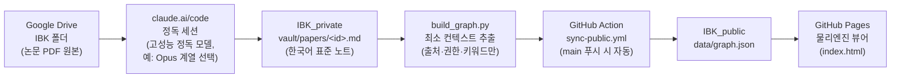

# 시스템 구축 가이드 (웹 전용)

이 문서는 **브라우저만으로** — claude.ai / claude.ai/code 와 github.com 웹 UI만 사용해서 —
논문 지식 시스템 전체를 구축하는 절차를 설명합니다. 로컬 터미널이나 CLI 설치는 필요 없습니다.

---

## (a) 시스템 개요

### 아키텍처



- **IBK_private** (비공개): 논문 노트 전문, 인용문, 수식, evidence 등 모든 지식이 사는 곳.
- **IBK_public** (공개): `data/graph.json` 과 물리엔진 뷰어 `index.html` 만 있는 전시장.
- 두 저장소 사이를 오가는 것은 오직 `graph.json` 하나이며, 그 내용은 아래 원칙에 따라 최소화됩니다.

### 설계 원칙 3가지

1. **Vault 독립성** — 지식의 원본은 언제나 `IBK_private/vault/` 의 Markdown 노트입니다.
   뷰어·그래프·자동화가 전부 사라져도 vault만 있으면 시스템은 온전합니다.
   (Obsidian 등 어떤 Markdown 도구로도 그대로 열 수 있습니다.)
2. **최소 컨텍스트 교환** — 공개 저장소로 나가는 것은 **출처(source)·권한(permission)·키워드(topics/keywords/methods)**
   수준의 메타데이터뿐입니다. 노트 본문, 수식, 인용문(원문 근거), 저자, venue, relations의 `evidence` 필드는
   **절대 export되지 않습니다**. `permission: private` 노트는 노드 자체가 나가지 않고 개수로만 집계됩니다.
3. **물리엔진 = 탐색 장치, 진위 판단 장치 아님** — 뷰어의 인력·장력·반발력은 "어디를 다음에 읽을까",
   "어떤 주장 쌍이 부딪히나", "어디가 비어 있나"를 **탐색**하기 위한 것입니다.
   노드가 가깝다고 두 논문이 옳다는 뜻이 아니며, 진위 판단은 언제나 원문과 evidence로 돌아가서 합니다.

---

## (b) GitHub 저장소 준비 (웹)

### 현재 상태

| 저장소 | 공개 여부 | 역할 | 핵심 내용 |
|---|---|---|---|
| `squarrel808/IBK_private` | **Private (비공개 유지)** | 지식 원본 | `vault/`, `scripts/`, `.github/workflows/sync-public.yml`, `.claude/skills/paper-note/`, `CLAUDE.md`, `docs/` |
| `squarrel808/IBK_public` | Public | 그래프 전시 | `index.html`(물리엔진 뷰어), `data/graph.json` |

초기 구축 작업은 두 저장소 모두 **`claude/paper-knowledge-vault-uaou3o`** 브랜치에 올라가 있습니다.
자동 동기화 워크플로는 **main 브랜치에서만** 동작하므로, 먼저 main으로 머지해야 합니다.

### PR 머지 절차 (github.com 웹)

각 저장소(`IBK_private` 먼저, 그다음 `IBK_public`)에 대해:

1. github.com 에서 저장소를 엽니다 (예: `https://github.com/squarrel808/IBK_private`).
2. 상단 **Pull requests** 탭 → **New pull request**.
3. base: `main`, compare: `claude/paper-knowledge-vault-uaou3o` 선택.
   - 브랜치 푸시 직후라면 저장소 첫 화면의 "Compare & pull request" 노란 배너를 눌러도 됩니다.
4. **Create pull request** → 변경 파일(Files changed 탭)을 훑어본 뒤 → **Merge pull request** → **Confirm merge**.
5. 머지 후 "Delete branch" 버튼으로 작업 브랜치를 정리해도 됩니다.

> 참고: `IBK_private` 를 main으로 머지하는 순간 `sync-public.yml` 이 실행되지만,
> 아래 (e)의 `PUBLIC_SYNC_TOKEN` 시크릿이 아직 없으면 동기화 단계가 실패합니다.
> 정상입니다 — (e)를 마친 뒤 Actions 탭에서 **Re-run jobs** 하거나 다음 푸시 때 자동으로 해소됩니다.

### 비공개 유지 확인

`IBK_private` → **Settings** → **General** 맨 아래 **Danger Zone** 에서
저장소가 **Private** 인지 확인하세요. 저장소 이름 옆에 `Private` 배지가 보여야 합니다.
이 저장소가 공개되면 최소 컨텍스트 원칙 전체가 무의미해집니다.

---

## (c) Google Drive 연결

### 커넥터 연결 (권장 경로)

1. claude.ai 접속 → 좌측 하단 프로필 → **설정(Settings)**.
2. **커넥터(Connectors)** 메뉴 → **Google Drive** 찾기 → **연결(Connect)**.
3. 구글 계정 인증 창이 뜨면 논문 PDF가 있는 계정으로 로그인하고 권한을 허용합니다.
4. claude.ai/code 에서 **새 코드 세션**을 시작하고, 세션의 커넥터/도구 목록에
   Google Drive가 활성화되어 있는지 확인합니다. (세션 시작 시 커넥터 선택 UI가 있으면 체크)
5. 세션에서 "Drive의 IBK 폴더 목록을 보여줘"라고 요청해 실제로 읽히는지 확인합니다.

### IBK 폴더 권장 구조

```
IBK/
└── papers/
    ├── 2020-gu-ml-asset-pricing.pdf
    ├── 2024-xxx-term-structure.pdf
    └── ...            # <year>-<slug>.pdf 형식 권장
```

- 파일명을 `<year>-<slug>.pdf` 로 통일하면 노트의 `source.drive_path` 와 노트 `id` 대응이 쉬워집니다.
- 노트 front matter에는 `source.drive_path: "IBK/papers/<파일명>.pdf"` 형태로 기록됩니다.

### 커넥터가 없거나 연결 전이라면 — 대안 2가지

1. **세션에 PDF 직접 업로드**: claude.ai/code 세션 입력창에 PDF 파일을 첨부(드래그 앤 드롭)하고
   정독을 요청합니다. 이 경우 `source.drive_path` 에는 Drive에 올려 둔(또는 올릴 예정인) 경로를 적어 둡니다.
2. **Drive 공유 링크 전달**: Drive에서 해당 PDF의 "링크 복사"(링크가 있는 사용자 보기 권한)를 만들어
   세션에 붙여 넣습니다. 링크는 `source.drive_url` 에 기록됩니다.

---

## (d) claude.ai/code 환경 설정

### 저장소 접근 권한 부여

1. claude.ai → **설정(Settings)** → **커넥터/연동** 에서 **GitHub** 연결 상태를 확인합니다.
   (처음이라면 GitHub 계정 인증 → Claude GitHub 앱 설치 화면으로 이어집니다.)
2. GitHub 앱 설치/설정 화면에서 접근 허용 저장소에 **`squarrel808/IBK_private`** 와
   **`squarrel808/IBK_public`** 를 모두 추가합니다.
   - 이미 설치되어 있다면 github.com → 프로필 → **Settings** → **Applications** →
     Claude 앱 → **Configure** 에서 Repository access에 두 저장소를 추가할 수 있습니다.
3. claude.ai/code 에서 새 세션을 만들 때 저장소 선택 목록에 `IBK_private` 가 나타나면 성공입니다.
   - 평상시 논문 정독 세션은 **`IBK_private`** 저장소로 시작합니다.

### 정독 모델 선택

- 세션 시작 시(또는 세션 내 모델 선택 메뉴에서) **고성능 정독 모델(예: Opus 계열)** 을 선택합니다.
- 논문 정독은 수식·표·각주까지 전부 읽고 evidence를 뽑아야 하는 작업이라,
  빠른 경량 모델보다 고성능 모델이 노트 품질 차이를 크게 만듭니다.
- 세션이 `IBK_private` 를 열면 저장소의 `CLAUDE.md` 와 `.claude/skills/paper-note/` 스킬이
  자동으로 로드되어 `/paper-note` 절차를 따를 수 있게 됩니다.

---

## (e) 자동 동기화 설정 (PUBLIC_SYNC_TOKEN)

`IBK_private` 의 main에 vault 변경이 푸시되면 `.github/workflows/sync-public.yml` 이
`graph.json` 을 다시 빌드해 `IBK_public/data/graph.json` 으로 푸시합니다.
이를 위해 IBK_public에 쓸 수 있는 토큰이 필요합니다.

### 1단계 — Fine-grained PAT 발급 (github.com)

1. github.com 우측 상단 프로필 → **Settings**.
2. 좌측 맨 아래 **Developer settings** → **Personal access tokens** → **Fine-grained tokens** → **Generate new token**.
3. 설정값:
   - **Token name**: `ibk-public-sync` (아무 이름이나 가능)
   - **Expiration**: 90일 등 원하는 만료 기간 (만료 시 재발급·재등록 필요 — 달력에 메모 권장)
   - **Resource owner**: `squarrel808`
   - **Repository access**: **Only select repositories** → **`IBK_public` 만 선택** (private 저장소는 절대 포함하지 않음)
   - **Permissions** → **Repository permissions** → **Contents**: **Read and write** (그 외 권한은 모두 No access)
4. **Generate token** → 표시되는 토큰 문자열(`github_pat_...`)을 복사합니다.
   **이 화면을 벗어나면 다시 볼 수 없습니다.**

### 2단계 — IBK_private에 시크릿 등록

1. `https://github.com/squarrel808/IBK_private` → **Settings** 탭.
2. 좌측 **Secrets and variables** → **Actions** → **New repository secret**.
3. **Name**: `PUBLIC_SYNC_TOKEN` (철자 정확히), **Secret**: 복사해 둔 토큰 붙여넣기 → **Add secret**.

### 3단계 — 동작 확인

1. `IBK_private` → **Actions** 탭 → 좌측 **sync-public** 워크플로 선택.
2. **Run workflow** 버튼(workflow_dispatch)으로 수동 실행하거나, 이전 실패 실행을 **Re-run jobs**.
3. 초록색 체크가 뜨면 `IBK_public` 저장소의 `data/graph.json` 최근 커밋이
   `chore: sync knowledge graph from private vault` 인지 확인합니다.

---

## (f) GitHub Pages 활성화

1. `https://github.com/squarrel808/IBK_public` → **Settings** → 좌측 **Pages**.
2. **Build and deployment** → **Source**: **Deploy from a branch**.
3. **Branch**: `main`, 폴더: **`/ (root)`** → **Save**.
4. 1~2분 후 Pages 설정 화면 상단에 발행 URL이 표시됩니다:
   `https://squarrel808.github.io/IBK_public/`
5. 해당 URL을 열어 물리엔진 뷰어가 뜨고 그래프가 로드되는지 확인합니다.
   - 노드가 하나도 없다면: 아직 `permission: public`/`team` 노트가 없거나 동기화가 안 된 상태입니다.
     (private 노트만 있으면 그래프는 비어 있는 것이 **정상**입니다.)

---

## (g) 확인 체크리스트

구축이 끝났는지 아래 순서대로 점검하세요.

- [ ] `IBK_private`, `IBK_public` 모두 `claude/paper-knowledge-vault-uaou3o` → `main` PR 머지 완료
- [ ] `IBK_private` 저장소에 **Private** 배지 확인
- [ ] claude.ai 설정 → 커넥터에서 **Google Drive 연결됨** 확인, 새 코드 세션에서 IBK 폴더 조회 성공
- [ ] Claude GitHub 앱의 Repository access에 `IBK_private` · `IBK_public` 포함
- [ ] claude.ai/code 에서 `IBK_private` 세션 생성 가능 + 고성능 정독 모델 선택 가능
- [ ] Fine-grained PAT 발급 (IBK_public만, Contents Read and write) 후
      `IBK_private` Actions 시크릿에 **`PUBLIC_SYNC_TOKEN`** 등록
- [ ] Actions 탭에서 **sync-public** 수동 실행 → 초록색 성공
- [ ] `IBK_public/data/graph.json` 에 동기화 커밋 확인
- [ ] GitHub Pages 발행 URL(`https://squarrel808.github.io/IBK_public/`)에서 뷰어 로드 확인
- [ ] (내용 점검) `data/graph.json` 을 웹에서 열어 **본문·저자·evidence가 없는지** 눈으로 확인

구축이 끝났다면 이제 [`docs/WORKFLOW.md`](WORKFLOW.md) 의 운영 워크플로를 따라
논문을 한 편씩 쌓아 가면 됩니다.
